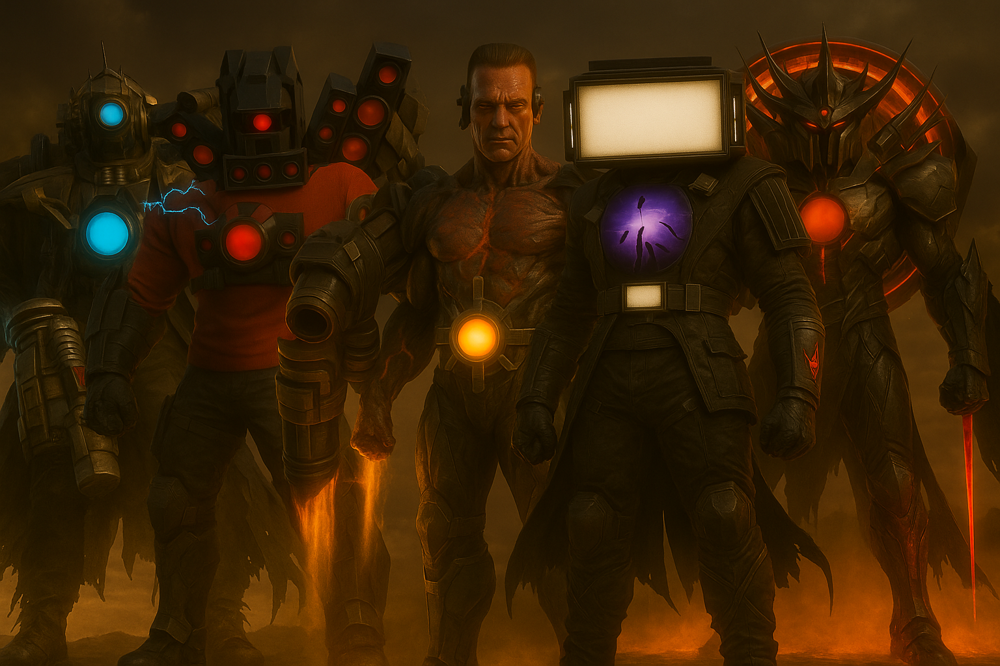

# 🎬 Skibidi Madness - Official Website



## 🌟 Overview

**Skibidi Madness** is an epic multi-universe animation series created by **FireStormX Studios** that transcends the boundaries of the original Skibidi Toilet universe. This repository contains the official website with a dynamic admin panel for content management.

### 🎯 Key Features

- **Dynamic Content Management**: MySQL database-driven content
- **Admin Panel**: Secure admin area with CRUD operations for all content
- **Image Upload**: Direct image upload capability for all entities
- **Landing Page Editor**: Customize homepage content through admin panel
- **Responsive Design**: Optimized for all devices from mobile to desktop
- **Post-Apocalyptic Theme**: Dark, gritty aesthetics with neon accents
- **Interactive Hero Gallery**: Hover effects and video previews
- **Video Integration**: Embedded promo videos and YouTube links
- **SEO Optimized**: Meta tags and semantic HTML structure

## 🚀 Quick Start

### Prerequisites

- **Apache Web Server** (with mod_rewrite enabled)
- **PHP** 8.1 or higher
- **MySQL** 5.7 or higher
- **Composer** (optional, for future extensions)

### Installation

#### 1. Clone the Repository

```bash
git clone https://github.com/skibimad/web.git
cd web
```

#### 2. Configure Apache

Copy the Apache virtual host configuration:

```bash
sudo cp setup/apache-vhost.conf /etc/apache2/sites-available/skibidi-madness.conf
```

Edit the configuration file to match your directory path:

```bash
sudo nano /etc/apache2/sites-available/skibidi-madness.conf
```

Enable the site and required modules:

```bash
sudo a2ensite skibidi-madness
sudo a2enmod rewrite
sudo systemctl restart apache2
```

#### 3. Run the Installation Script

The installation script will create the database and tables:

```bash
cd setup
chmod +x install.sh
./install.sh
```

Follow the prompts to enter your MySQL credentials. The script will:
- Create the `skibidi_madness` database
- Set up all required tables
- Insert demo data (heroes, episodes, blog posts)
- Create the default admin user
- Configure the application

#### 4. Set Permissions

Ensure the uploads directory is writable:

```bash
chmod -R 755 uploads
chown -R www-data:www-data uploads
```

#### 5. Access the Website

- **Website**: http://localhost (or your configured domain)
- **Admin Panel**: http://localhost/admin/

### Default Admin Credentials

```
Username: fsx
Password: 111111
```

**⚠️ IMPORTANT**: Change the admin password immediately after first login!

## 📁 Project Structure

```
skibidi-madness-web/
├── index.php                   # Main homepage (database-driven)
├── blog.php                    # Blog listing page
├── blog-post.php              # Individual blog post page
├── config.php                 # Database configuration (not in repo)
├── config.example.php         # Configuration template
├── .htaccess                  # Apache rewrite rules
├── admin/                     # Admin panel
│   ├── login.php             # Admin login
│   ├── index.php             # Admin dashboard
│   ├── episodes.php          # Episode management
│   ├── heroes.php            # Hero management
│   ├── blog.php              # Blog management
│   ├── landing.php           # Landing page editor
│   ├── settings.php          # Admin settings
│   ├── logout.php            # Logout handler
│   └── includes/             # Shared admin files
│       ├── header.php
│       └── footer.php
├── database/                  # Database layer
│   ├── Database.php          # Database connection
│   ├── Model.php             # Base model class
│   ├── Auth.php              # Authentication helper
│   ├── FileUpload.php        # File upload handler
│   └── models/               # Entity models
│       ├── Hero.php
│       ├── Episode.php
│       ├── BlogPost.php
│       ├── User.php
│       └── LandingContent.php
├── setup/                     # Installation files
│   ├── database.sql          # Database schema & seed data
│   ├── install.sh            # Installation script
│   └── apache-vhost.conf     # Apache configuration
├── styles/                    # CSS stylesheets
│   └── main.css
├── scripts/                   # JavaScript files
│   └── main.js
├── res/                       # Static resources
│   ├── img/                  # Images
│   └── video/                # Videos
└── uploads/                   # User-uploaded files
    ├── heroes/
    ├── episodes/
    └── blog/
```

## 🗄️ Database Schema

The application uses the following tables:

- **users**: Admin user accounts
- **heroes**: Hero characters with abilities
- **episodes**: Episode information
- **blog_posts**: Blog posts and news
- **landing_content**: Editable landing page sections

All tables use UTF-8 character set and include timestamps for created/updated tracking.

## 🛠️ Configuration

### Database Settings

Copy `config.example.php` to `config.php` and update with your credentials:

```php
define('DB_HOST', 'localhost');
define('DB_NAME', 'skibidi_madness');
define('DB_USER', 'your_username');
define('DB_PASS', 'your_password');
```

### Upload Directory

The upload directory can be configured in `config.php`:

```php
define('UPLOAD_DIR', __DIR__ . '/uploads/');
define('UPLOAD_URL', '/uploads/');
```

## 📋 Admin Panel Features

### Dashboard
- Overview of content statistics
- Quick actions for common tasks
- System information

### Episodes Management
- Create, read, update, delete episodes
- Upload thumbnail images
- Set video URLs and metadata
- Order by episode number

### Heroes Management
- Manage hero profiles
- Upload hero images
- Define abilities (JSON array)
- Set display order

### Blog Management
- Create and edit blog posts
- Upload featured images
- Set publish status
- Auto-generate slugs from titles

### Landing Page Editor
- Edit hero section content
- Customize about section
- Update channel section text

### Settings
- Change admin password
- View system information

## 🎨 Design & Theme

### Color Palette

- **Primary Red**: `#ff3366` - Action, danger, energy
- **Secondary Cyan**: `#00ffcc` - Technology, future
- **Accent Yellow**: `#ffcc00` - Highlights, warnings
- **Accent Purple**: `#9933ff` - Mystery, power
- **Dark Backgrounds**: `#0a0a0f`, `#141419`, `#1e1e28`

### Typography

- **Headings**: [Orbitron](https://fonts.google.com/specimen/Orbitron) - Futuristic, tech-inspired
- **Body Text**: [Rajdhani](https://fonts.google.com/specimen/Rajdhani) - Modern, readable

## 📺 YouTube Integration

### Official Channels & References

- **FirestomX-Tri**: [@FirestomX-Tri](https://www.youtube.com/@FirestomX-Tri) - Official channel
- **DaFuq!?Boom!**: [@DaFuqBoom](https://www.youtube.com/@DaFuqBoom) - Original Skibidi Toilet creator

## 🔒 Security

- Password hashing using PHP's bcrypt
- Session-based authentication
- SQL injection protection via PDO prepared statements
- CSRF protection recommended for production
- File upload validation (images only, 5MB limit)
- Admin area protected by authentication

## 🌐 Deployment

### Production Checklist

1. Update `config.php` with production database credentials
2. Change admin password from default
3. Set `display_errors` to `0` in `config.php`
4. Configure proper file permissions (755 for directories, 644 for files)
5. Enable HTTPS with SSL certificate
6. Set up regular database backups
7. Configure proper error logging

### Apache Configuration

Ensure these modules are enabled:
```bash
sudo a2enmod rewrite
sudo a2enmod php
sudo systemctl restart apache2
```

## 🧪 Testing

Access different parts of the site:

- Homepage: `http://your-domain/`
- Blog: `http://your-domain/blog.php`
- Admin: `http://your-domain/admin/`

Test admin functions:
1. Login with default credentials
2. Change password
3. Create/edit/delete content in each section
4. Upload images
5. Edit landing page content

## 📊 SEO & Metadata

The site includes:
- Meta descriptions
- Open Graph tags
- Semantic HTML structure
- Keyword optimization
- Accessibility features

## 🤝 Contributing

This is the official website for the Skibidi Madness series. For questions or issues:

1. Check existing issues
2. Create a detailed bug report
3. Include steps to reproduce

## 📜 License

See [LICENSE](LICENSE) file for details.

## ⚠️ Disclaimer

**Skibidi Madness** is a fan-created series inspired by the Skibidi Toilet universe created by DaFuq!?Boom!. This project is not officially affiliated with the original creator. All trademarks and copyrights belong to their respective owners.

This website is created for entertainment and promotional purposes.

## 📞 Contact & Support

- **YouTube**: [@FirestomX-Tri](https://www.youtube.com/@FirestomX-Tri)
- **Original Creator**: [@DaFuqBoom](https://www.youtube.com/@DaFuqBoom)

## 🎉 Special Thanks

- DaFuq!?Boom! for creating the original Skibidi Toilet universe
- All fans and supporters of the series

---

**Made with ❤️ by FireStormX Studios**

*Where Chaos Meets Destiny*
